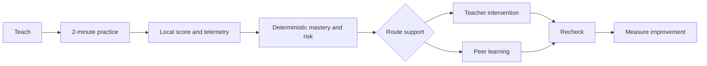
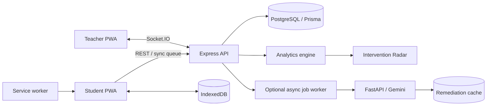

# Page 1 of 6 — Platform Overview, Product Scope, and Technical Foundation

# Offline-First Blended Learning Platform

## 1. Executive summary

This is an active classroom learning system for blended learning—not a passive learning-management dashboard. It connects short digital practice with timely teacher support, peer learning, and reassessment.

The MVP uses a **Next.js PWA** for student and teacher workflows, an **Express REST and Socket.IO API** as the trusted boundary, and **PostgreSQL with Prisma** as the authoritative data store. A separate **FastAPI AI service** may later provide optional remediation, but deterministic services always grade, calculate mastery, and determine learning intervention risk.

The four architectural commitments are:

1. **Offline first:** a learner can complete a downloaded quiz and retain progress during an outage.
2. **Shared-device safe:** each student’s device-local state is isolated and never shown to the next student.
3. **Explainable intervention:** the teacher sees the evidence, knowledge component, priority, and recommended classroom action.
4. **Blended action loop:** a result routes to teacher support or peer learning and is followed by a measurable recheck.



### Recommended system boundary



## 2. Problem definition

Traditional educational applications break down in the target classroom because they assume continuous internet, one student per device, and enough teacher time to inspect passive analytics. This system must solve four operational problems.

| Problem | Required outcome |
|---|---|
| Unreliable internet | Downloaded learning packages work offline; answers and telemetry queue safely until sync. |
| Shared devices | Student A’s session, answers, and telemetry remain isolated from Student B. |
| Too many learners for manual monitoring | The teacher receives one useful, deduplicated intervention alert rather than raw event noise. |
| Digital/physical learning disconnect | A diagnosed knowledge gap leads to a concrete teacher or peer activity, then a recheck. |

The platform may report only educational signals, such as repeated incorrect answers, long hesitation, abandonment, answer changes, help requests, and prerequisite errors. It must not infer or label emotional, psychological, or medical states.

## 3. Product goals and MVP success criteria

### Product goals

- Deliver short, concept-specific formative assessments designed for approximately two minutes.
- Store quiz answers locally before any network request.
- Calculate deterministic local feedback from a downloaded assessment package.
- Build mastery estimates at the Knowledge Component (KC) level.
- Identify explainable **Learning Intervention Risk** using transparent rules.
- Keep the teacher’s Intervention Radar current through authorized real-time events while connected.
- Support a teacher-reviewed red/yellow/green routing model: teacher support, peer practice, and extension work.
- Collect only educational data necessary to deliver and improve the learning workflow.

### MVP acceptance scenario

The MVP is complete when it demonstrates all of the following together:

1. A teacher starts a classroom session with learners across digital, teacher, and peer stations.
2. A learner loses connectivity, continues a downloaded quiz, gets local feedback, and has answers/telemetry recorded in IndexedDB.
3. On a shared device, the learner ends their turn; the next learner cannot access any prior answers, progress, or UI state.
4. When connectivity returns, queued events synchronize once; retries and duplicates are ignored safely.
5. Three KC-related errors create a high-priority, evidence-backed intervention event—for example, Array Indexing, 39% mastery, and three consecutive incorrect responses.
6. The teacher acknowledges the alert, records a physical intervention, and assigns a recheck.
7. The system records the recheck outcome, including an improvement such as 39% to 72%.
8. A yellow learner can be matched to an appropriate green mentor after teacher review.

### Explicit non-goals for the MVP

- Simultaneous, identity-inferred multi-touch interaction on one screen.
- AI-generated official grades or risk decisions.
- Dependence on Gemini, background sync, Redis, wearable hardware, or push notifications for quiz completion.
- Student-to-student free-form messaging.
- Claiming legal compliance solely from technical controls.

## 4. Users and authorization model

| Role | Primary workflow | Allowed data scope |
|---|---|---|
| Student | Complete assigned work, view own progress, participate in assigned peer activity | Own records only |
| Teacher | Run class, receive/interact with Radar alerts, manage rotations and peer pods | Assigned classrooms only |
| Institution admin | Manage institution users, curriculum, classes, and reports | Authorized institution data |
| Platform support | Diagnose availability/security incidents under controlled access | Minimum operational data; no routine learner-content browsing |

Authorization is enforced in two places: at the API service layer for every request and, where supported by the database provider, at the database layer. Client-side route guards improve the user experience but do not establish authorization.

## 5. Technology choices

| Layer | Decision | Why |
|---|---|---|
| Web app | Next.js, React, TypeScript, Tailwind, shadcn/ui | Responsive App Router UX and maintainable component system |
| Client state | Zustand + TanStack Query | Separates local UI/session state from synchronized server state |
| Validation | React Hook Form + Zod | Shared, typed input validation and predictable errors |
| API | Node.js, Express, TypeScript | A focused REST/sockets boundary independent of rendering |
| Database | PostgreSQL + Prisma | Strong relational integrity, transactions, auditability, and predictable queries |
| Real-time | Socket.IO/WebSockets | Live classroom pulse and Radar updates—not ordinary CRUD |
| Offline | Service worker + IndexedDB + sync outbox | Durable local learning state and network-resilient operation |
| AI enhancement | Python FastAPI + Gemini | Optional, asynchronous remediation isolated from core assessment |
| Authentication | Better Auth, validated in an integration spike | Secure session management with server-side authority |

PostgreSQL is preferred over NoSQL: institutions, classes, memberships, curriculum, assessment versions, attempts, interventions, and audit trails have strong relationships and require reliable transactional behavior.

## 6. Monorepo architecture

Use a pnpm workspace monorepo with Turborepo only for build/test orchestration. The system is modular, but it is not prematurely decomposed into many runtime services.

```text
blended-learning-platform/
├── apps/
│   ├── web/                    # Next.js App Router PWA
│   ├── api/                    # Express REST API and Socket.IO server
│   └── ai-service/             # FastAPI, optional remediation/generation
├── packages/
│   ├── database/               # Prisma schema, migrations, generated client
│   ├── shared/                 # DTOs, Zod schemas, enums, event contracts
│   ├── analytics-engine/       # mastery, misconception, risk, peer-pods
│   └── config/                 # shared TypeScript, ESLint, Tailwind config
├── docs/
│   ├── architecture/  ├── api/  ├── database/  ├── offline/
│   ├── ai/            └── security/
└── tests/{unit,integration,e2e}/
```

`packages/shared` is the single home for wire contracts and Zod schemas. `packages/analytics-engine` is a pure, deterministic library with no database or HTTP dependency, making scoring and risk rules easy to test and audit. The FastAPI service is deliberately optional: an AI outage must never stop a student from completing a quiz or a teacher from receiving a deterministic intervention alert.

---

**Next:** Page 2 defines the frontend architecture, offline assessment package, Knowledge Component mapping, and local-first sync behavior.
