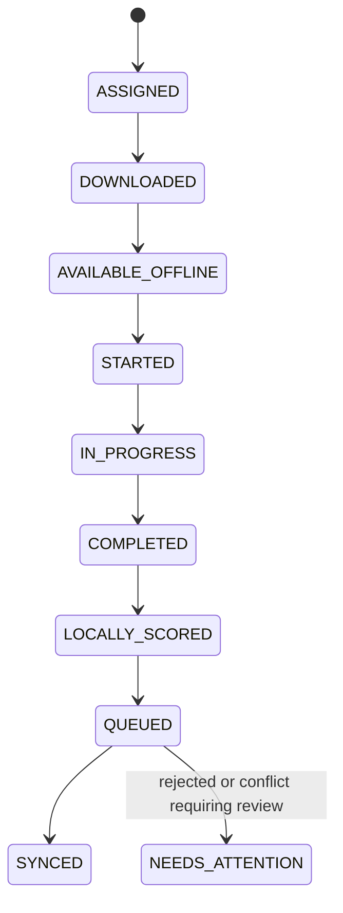

# Page 2 of 6 — Frontend, Assessment, and Offline-First Architecture

## 7. Frontend architecture

The web application is a mobile-first Next.js App Router PWA. It has separate public, student, teacher, and admin route groups, but all sensitive access remains enforced by the API. The UI must clearly display connectivity and synchronization status so learners and teachers understand whether their work is safely saved locally or synchronized to the server.

```text
apps/web/
├── app/
│   ├── (public)/              # sign-in, privacy notice, help
│   ├── (student)/             # dashboard, quiz, progress, peer activity
│   ├── (teacher)/             # classroom mode, Radar, rotations, pods
│   ├── (admin)/               # institution and curriculum administration
│   ├── layout.tsx
│   └── manifest.ts
├── components/
│   ├── ui/                    # shadcn/ui primitives
│   ├── student/  ├── teacher/ ├── quiz/
│   ├── intervention/ ├── peer/ ├── kiosk/ └── offline/
├── hooks/                     # useOnlineStatus, useSync, useKioskSession
├── stores/                    # Zustand UI, session, kiosk, connectivity state
├── services/                  # typed API client, socket client, sync service
├── lib/                       # IndexedDB, service-worker and utility modules
├── locales/{en,hi,gu,mr,ta,te}/
└── public/                    # icons and offline-safe static assets
```

### State ownership

| State category | Owner | Persistence |
|---|---|---|
| Route/session presentation state | Zustand | Memory; cleared at kiosk handoff |
| Server data (classrooms, current dashboard) | TanStack Query | Controlled cache only; never a source of offline truth |
| Quiz answers, attempts, events, downloaded packages | IndexedDB | Durable, per-profile namespace |
| Form draft/validation | React Hook Form + Zod | Local component state; persist only where explicitly required |
| Socket connection and live class pulse | Service + Zustand selector | Reconnectable, non-authoritative view state |

Use optimistic UI only for actions that already have a durable local record or an acknowledged server response. Never display an online-only mutation as completed before it is safely queued or confirmed.

## 8. PWA and caching strategy

The service worker serves a versioned application shell and explicitly managed content packages. It is not a substitute for an offline database.

| Resource | Strategy | Reason |
|---|---|---|
| HTML/application shell | Precache with controlled version updates | App opens during an outage |
| JavaScript/CSS/fonts | Precache or cache-first with content hash | Immutable build assets |
| Downloaded quiz/content package | IndexedDB plus cache metadata | Must be versioned, inspectable, and profile-aware |
| Images/video | Explicit download policy and byte budget | Avoid unexpectedly filling device storage |
| Teacher live data | Network-first; show stale timestamp on fallback | Live information should not masquerade as current |
| Authenticated REST responses | Do not broadly cache | Prevent sensitive cross-user leakage |

On a new PWA release, retain the active shell until the learner finishes or safely queues an in-progress attempt. Prompt for an update after the attempt, rather than breaking a quiz mid-session. Cache quotas and package download size are visible to the user/teacher.

### Connectivity states

The app exposes four explicit states:

- **Online:** server reachable; newly queued items are being synchronized.
- **Offline:** learning continues from downloaded content; queued count is displayed.
- **Syncing:** the outbox is being reconciled; the student can keep working.
- **Needs attention:** a package is unavailable, storage is full, or a rejected event requires a safe resolution path.

`navigator.onLine` is only a hint. A lightweight, rate-limited API health check establishes actual service reachability. Losing connectivity never discards local progress.

## 9. Assessment and quiz execution

Quizzes are delivered as immutable, versioned packages. A package is downloaded before use and contains only the material needed for deterministic offline execution:

```json
{
  "packageId": "quiz-package-uuid",
  "version": 3,
  "quizId": "quiz-uuid",
  "expiresAt": "2026-08-20T10:00:00Z",
  "questions": ["question + options + scoring rule + KC map"],
  "scoringConfigVersion": "mastery-v1",
  "integrityHash": "sha256-...",
  "locale": "en"
}
```

The package may expire for new starts but must remain usable to finish an attempt that was already validly started, subject to institutional policy. The API checks package version, integrity metadata, authorization, and assignment status again during sync. It recalculates material results using the authoritative scoring configuration.



### Two-minute formative assessment requirements

Each micro-assessment should normally contain 3–5 mobile-friendly questions tied to a single concept or a tightly related KC group. It needs a small cognitive footprint, immediate deterministic feedback where pedagogically appropriate, readable language, clear progress, and a save/exit option. Do not make a network request per answer.

For each answer attempt, the client records: pseudonymous student/profile and device/session IDs, quiz/question/KC identifiers, answer, correctness, start/submission timestamps, latency, attempt number, answer-change count, network state, and package/scoring versions. Avoid unrelated device fingerprinting and unnecessary personal data.

## 10. Knowledge Component and mastery architecture

Every published question maps to one or more Knowledge Components (KCs) through a versioned join record. Mapping weights total 1 per question. KC prerequisites form a directed acyclic graph, validated at content publication time.

Example:

```text
Topic: Arrays
KC-001 Array declaration
KC-002 Array indexing       ← question mapped here
KC-003 Array traversal      ← depends on KC-002
KC-004 Array insertion
```

The mastery service is deterministic and configuration-driven. It treats accuracy as primary evidence, rewards efficient correct responses only within a reasonable range, and uses recent weighted KC evidence to moderate rather than replace correctness.

```text
accuracy       = correctAnswers / assessedAnswers
latencyScore   = clamp(targetSeconds / observedSeconds, 0, 1) when correct; 0 otherwise
kcPerformance  = weighted recent correctness for this KC

mastery = 0.60 × accuracy
        + 0.15 × latencyScore
        + 0.25 × kcPerformance
```

All weights, scoring-window sizes, minimum attempt counts, target latency, and red/yellow/green thresholds are stored as versioned configuration. An extremely fast incorrect response yields no mastery benefit; latency cannot dominate accuracy. Display the estimate and its evidence in understandable terms, rather than presenting it as an unquestionable diagnosis.

## 11. IndexedDB data model

Each logical record includes `schemaVersion`, `deviceId`, `profileNamespace`, timestamps, and a stable ID. The profile namespace is mandatory for every student-owned local lookup.

| Object store | Key | Purpose |
|---|---|---|
| `profiles` | `profileNamespace` | Minimal local profile/session envelope; no unnecessary PII |
| `contentPackages` | `packageId:version` | Downloaded immutable assessment and content packages |
| `attempts` | `namespace:attemptId` | Attempt lifecycle and local score |
| `answers` | `namespace:attemptId:questionId` | Durable answer state and change count |
| `telemetryEvents` | `eventId` | Append-only educational interaction telemetry |
| `syncQueue` | `eventId` | Ordered outbox, attempts, error/retry metadata |
| `syncReceipts` | `eventId` | Server acceptance/deduplication receipts |
| `settings` | `deviceId:key` | PWA and accessibility settings, never cross-profile data |

Local writes for an answer and its telemetry occur inside one IndexedDB transaction: update answer state, append telemetry, append/replace the related sync event, then commit. A crash cannot leave an answer marked complete without a record that it must eventually synchronize.

## 12. Sync and idempotency design

The client uses an append-only outbox. Every event has a globally unique UUID `eventId`, a per-device increasing `sequence`, event type, actor/profile namespace, occurrence time, payload hash, schema version, and idempotency key. The API batches events and returns an item-level receipt, not an all-or-nothing response.

```mermaid
sequenceDiagram
  participant P as Student PWA
  participant I as IndexedDB
  participant A as API
  participant D as PostgreSQL
  P->>I: atomically save answer, telemetry, and outbox event
  Note over P,I: Learner continues while offline
  P->>A: POST /api/v1/sync/batch
  A->>D: insert SyncEvent with unique eventId
  alt first delivery
    A->>D: validate, persist, and recompute trusted results
    A-->>P: accepted receipt and server outcome
  else retry / duplicate
    A-->>P: duplicate receipt and prior outcome
  else invalid
    A-->>P: rejected receipt with safe resolution code
  end
  P->>I: mark accepted; retain only unresolved records
```

The database enforces uniqueness on `(institutionId, eventId)`. The server processes valid events transactionally, stores a durable receipt, and never trusts locally calculated mastery as authoritative. Ordering is respected where it matters (for example, within an attempt); independent telemetry can be safely processed in a batch. Rejected events remain local with an actionable state, never silently disappear.

Background Sync is used where supported, but the required mechanism is foreground synchronization on app open, reconnect, and explicit retry. Retry uses exponential backoff with jitter and a bounded policy. Do not promise instant synchronization after connectivity returns.

## 13. Offline test gate

Before progressing to the kiosk/backend module, automated end-to-end tests must prove:

1. A downloaded quiz opens with the network blocked.
2. Answers, timing, and local score persist after page reload or browser restart.
3. Reconnection sends queued events and updates receipts.
4. Re-sending the same batch produces no duplicate attempts, telemetry, mastery updates, or alerts.
5. AI and real-time services may be unavailable without preventing quiz completion.

---

**Next:** Page 3 specifies strict shared-device kiosk isolation, backend layering, database relationships, and authorization controls.
