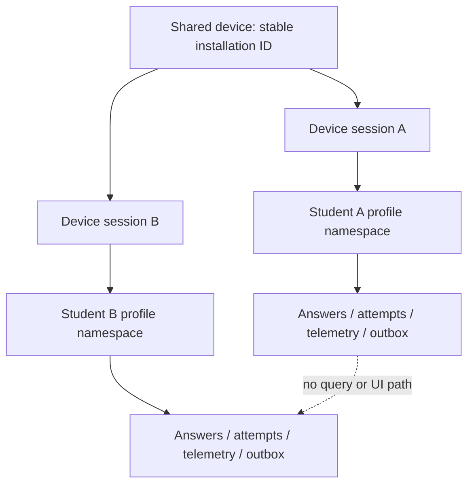
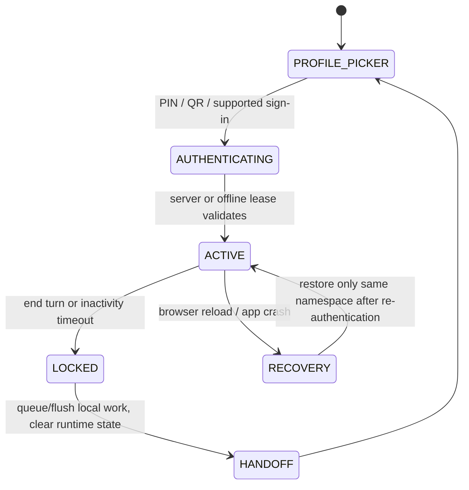
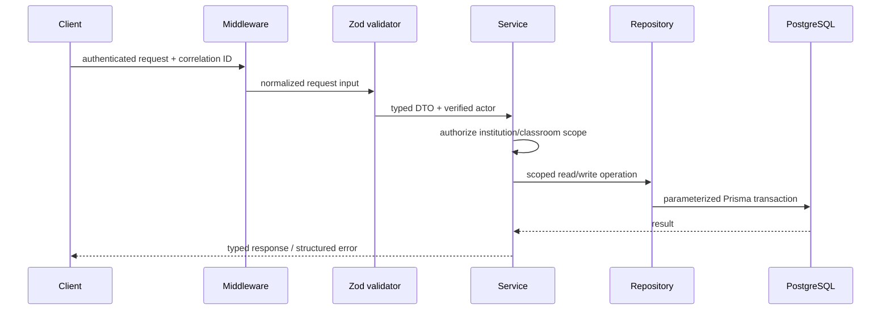
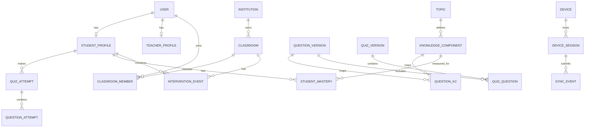

# Page 3 of 6 — Shared Devices, Backend, Database, and Authorization

## 14. Shared-device kiosk architecture

The MVP supports **sequential users** on a shared laptop, tablet, terminal, or interactive display. It does not claim to safely support simultaneous independent learners on the same screen. A device may host five or six students in sequence, but each turn is a separate device session and a separate local namespace.

### Core isolation rule

Every locally stored student record must be addressed by a random `profileNamespace`, not merely a device ID. The same namespace is carried into server events alongside the authenticated student/session identity, enabling consistency checks without making it a source of authority.



### Kiosk session lifecycle



At sign-in, the application creates a short-lived `DeviceSession` with a random identifier and a profile namespace. At an explicit **End turn** or inactivity lock it must:

1. Persist all active answer state and telemetry to IndexedDB.
2. Attempt synchronization when connected, but never wait indefinitely or discard unsynced work.
3. Clear in-memory React state, Zustand stores, TanStack Query cache, socket subscriptions, form state, and screen history.
4. Revoke the active server session where online; mark the local session locked.
5. Return to the profile picker with no prior student identity, content, or progress on screen.

The local namespace and unsynced events remain durable until they synchronize or reach a defined retention/operational-resolution policy. Do not wipe the entire browser store at handoff—doing so can lose valid offline learning data. Equally, never allow the next user to enumerate, open, or export another namespace.

### Authentication and offline leases

Full authentication should occur online whenever possible. For planned offline sessions, the school may pre-provision a limited, encrypted local **offline access lease** that binds an approved student profile to a device for a short period. The lease contains no raw password and expires quickly. It is an optional phase after core online kiosk flow and requires careful institutional device controls.

PINs must be rate-limited and must not be stored in recoverable form in IndexedDB. QR sign-in should encode a short-lived one-time token, not a permanent student identifier. Shared devices should use a dedicated browser profile/managed kiosk mode where schools can provide it.

## 15. Future multi-touch strategy

Multi-touch is a future feature, not an inferred behavior. The platform must never guess which learner owns a touch based on physical location, timing, or biometric-like patterns.

When a future shared-screen activity needs more than one learner at once, use explicit ownership:

- The teacher starts a named group activity with defined seat/slot count.
- Each learner claims a slot using an authenticated QR/PIN/device handoff flow.
- UI regions are tied to the claimed slot, and each event includes `activityId`, `slotId`, and authenticated actor ID.
- A participant may leave, lock, or transfer only through an explicit action.
- If identity cannot be established, collect only anonymous group interaction data or disable individual attribution.

This approach preserves correct telemetry ownership and makes future multi-touch auditable. It does not attempt to solve OS-level multi-user isolation inside one browser tab.

## 16. Backend architecture

The Express API is the system’s policy enforcement point and trusted write path. It handles authentication/session verification, input validation, authorization, API-level idempotency, persistence, analytics orchestration, audit records, and Socket.IO room membership. It does not contain untestable route-sized business logic.

```text
apps/api/src/
├── routes/          # versioned REST route registration
├── controllers/     # request/response translation only
├── validators/      # Zod request and query validation
├── middleware/      # auth, RBAC, CORS, rate limit, request ID, errors
├── services/        # use-case orchestration and transactions
├── repositories/    # Prisma data access and query scopes
├── websocket/       # Socket.IO auth, rooms, emitters, event schemas
├── jobs/            # durable outbox/analytics/AI job consumers
└── utils/           # logging, time, hashing, pagination helpers
```

Request flow:



Controllers cannot call Prisma directly. Repositories require an institution scope or a system-worker scope explicitly. Services create audit records for teacher intervention actions, privileged administration, device-session changes, and security-relevant events. Background jobs use the same service methods rather than bypassing authorization/business rules.

## 17. Authentication, RBAC, and tenancy

Use Better Auth with secure, httpOnly, `Secure`, and appropriate `SameSite` cookies. All state-changing cookie-authenticated requests require CSRF protections. Sessions carry a stable user ID and session ID; roles and current institution context are loaded/validated server-side rather than trusted from browser claims alone.

Authorization decisions use all relevant dimensions:

```text
actor identity
  + active session
  + institution membership
  + role
  + classroom assignment or ownership
  + resource relationship
  + requested action
```

Examples: a student can read only their own assignments and attempts; a teacher can see only classrooms to which they are assigned; an institution admin manages only their institution; a socket client joins only authorized teacher/classroom rooms. An ID in the URL never proves access.

Use a policy function such as `can(actor, action, resourceContext)` rather than scattered role string checks. Return a non-enumerating `403` or `404` according to the threat model; do not reveal other institutions’ resource existence.

## 18. Database architecture

PostgreSQL is the authoritative system of record. Prisma provides schema migration, typed data access, and relation mapping; it does not replace database constraints. Each tenant-owned table has `institutionId` either directly or through an enforceable relationship, with indexes that lead on institution and common query scope.

### Principal entities

| Area | Core entities |
|---|---|
| Identity and tenancy | `User`, `StudentProfile`, `TeacherProfile`, `Institution`, `Classroom`, `ClassroomMember` |
| Curriculum | `Course`, `Subject`, `Chapter`, `Topic`, `KnowledgeComponent`, `KnowledgeComponentPrerequisite` |
| Assessment | `Quiz`, `QuizVersion`, `Question`, `QuestionVersion`, `QuestionOption`, `QuestionKnowledgeComponent`, `QuizQuestion` |
| Learning evidence | `QuizAttempt`, `QuestionAttempt`, `TelemetryEvent`, `StudentMastery`, `Misconception`, `LearningRisk` |
| Intervention and peer learning | `InterventionEvent`, `InterventionAction`, `PeerPod`, `PeerPodMember`, `PeerActivity`, `Remediation` |
| Devices and operations | `Device`, `DeviceSession`, `SyncEvent`, `Notification`, `AuditLog`, `OutboxJob` |

Published curriculum and assessment content is append-only/versioned. Student attempts retain the exact question/quiz/scoring version used, so historical results remain reproducible after curriculum edits.



### Integrity and indexing requirements

- Unique: classroom membership; `(studentId, knowledgeComponentId)` mastery row; `(institutionId, eventId)` sync event; notification dedupe key; active-device-session constraints where applicable.
- Foreign keys: use restrictive or explicit archival behavior for learner evidence; never cascade-delete assessment history accidentally.
- Check constraints: mastery/risk ranges, valid workflow transitions where practical, non-negative attempt counts, valid rotation times.
- Indexes: institution/classroom/time for radar queries; student/KC/time for mastery; device/sequence and sync receipt queries; active intervention status/priority/created time.
- Soft-delete or archive curriculum/users based on defined retention rules; do not use soft deletion as a substitute for access control.

## 19. Row-level controls and data portability

With Supabase PostgreSQL, add RLS policies as defense in depth: students read their own records, teachers access learners through classroom membership, and institution administrators remain institution-scoped. Application authorization remains mandatory because elevated database connections, workers, and complex policies require consistent server-side checks.

With Neon or standard PostgreSQL, Supabase RLS behavior does not exist automatically. Use least-privilege database roles, a dedicated application role, parameterized Prisma queries, institution-scoped repositories, transaction boundaries, database constraints, and comprehensive authorization tests. The schema remains portable across providers.

## 20. Page 3 verification gate

Before building the intervention module, test the following:

1. Student A’s in-memory cache is cleared after handoff and Student B cannot open A’s local records.
2. Unsynced Student A events remain queued and synchronize under the correct authenticated identity without appearing in B’s interface.
3. Teacher, student, and admin API requests are rejected outside their allowed institution/classroom scope.
4. Socket connections cannot join an unauthorized classroom room or receive its Radar events.
5. Duplicate sync event IDs and invalid workflow transitions are rejected by database/application constraints.

---

**Next:** Page 4 specifies the deterministic learning-risk engine, Intervention Radar, teacher notification system, peer-pod generation, and classroom rotations.
