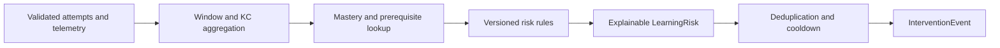
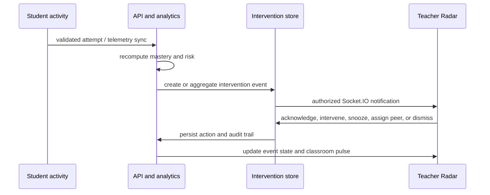
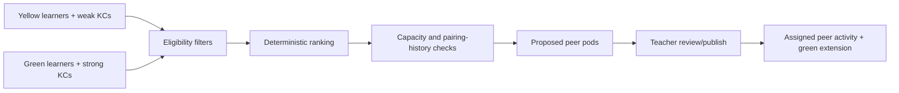
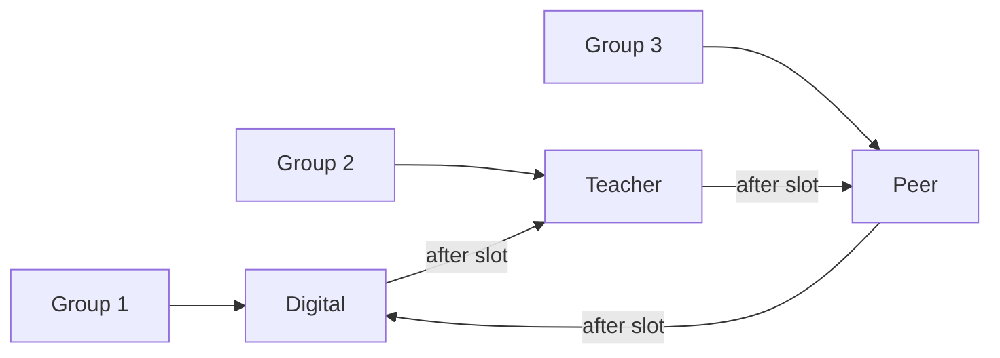

# Page 4 of 6 — Learning Risk, Intervention Radar, Peer Learning, and Rotations

## 21. Deterministic learning-risk engine

The risk engine converts validated learning evidence into **Learning Intervention Risk**. It is an educational prioritization system; it does not diagnose emotion, wellbeing, ability, or medical/psychological conditions.

The engine is a pure, deterministic module in `packages/analytics-engine/risk`. It accepts time-bounded attempt, telemetry, mastery, prerequisite, and help-request evidence and returns a versioned result with a human-readable explanation. Its inputs and rule version are stored with the result so every alert can be audited later.

### Signals and example rules

| Signal | Example rule | Role in decision |
|---|---|---|
| Repeated incorrect answers | 3 incorrect attempts for one KC within 10 minutes | Strong trigger |
| Low mastery | KC mastery below 50% after minimum evidence | Strong supporting evidence |
| Prerequisite errors | Errors on a prerequisite KC relevant to the current KC | Diagnosis/routing evidence |
| Long hesitation | Correct/incorrect attempt exceeds KC-specific target | Supporting evidence only |
| Answer changes | Multiple changes before submission | Supporting evidence only |
| Abandonment/inactivity | Quiz left unfinished beyond a configured period | Follow-up signal, not proof of a gap |
| Help requests | Repeated explicit requests in a single activity | Supporting evidence |

Example priority policy, subject to teacher-configurable institutional thresholds:

```text
LOW       = isolated evidence; continue observing
MEDIUM    = repeated evidence or a meaningful mastery decline
HIGH      = repeated KC errors + low mastery or prerequisite evidence
CRITICAL  = high evidence plus an explicitly configured urgent classroom condition
```

“Critical” is operational priority, not a claim about a learner’s health or safety. The platform always displays the rule evidence instead of a vague label.



## 22. Misconception-to-action routing

The misconception classifier remains rule-based in the MVP. It evaluates tagged distractors, answer patterns, KC/prerequisite mappings, and attempt history. It emits one of `CALCULATION_SLIP`, `READING_ERROR`, `CARELESS_ERROR`, `SYNTAX_ERROR`, `LOGICAL_ERROR`, `CONCEPTUAL_ERROR`, `PREREQUISITE_GAP`, or `UNKNOWN`, together with evidence and confidence limits.

Routing maps the combination of KC, mastery band, misconception category, and classroom context to a catalogued recommended action. For example, a prerequisite gap in Array Indexing can recommend a one-minute physical card-indexing activity; a yellow learner with a conceptual gap can receive guided peer teach-back practice. Recommendations are suggestions requiring teacher judgement, not automated student placement.

## 23. Intervention Radar architecture

The teacher dashboard has a persistent, prioritized Radar. It focuses attention on current classroom needs rather than forcing the teacher to interpret raw charts during a live lesson.

Each `InterventionEvent` stores:

```text
id, institutionId, classroomId, studentId, teacherId (when assigned),
priority, triggerFamily, evidence JSON, knowledgeComponentId,
recommendedActionId, recommendedActionText, status,
createdAt, acknowledgedAt, snoozedUntil, resolvedAt, outcome
```

Recommended statuses are `OPEN`, `ACKNOWLEDGED`, `SNOOZED`, `IN_PROGRESS`, `RESOLVED`, and `DISMISSED`. A transition is validated server-side and creates an `InterventionAction`/`AuditLog` record. Dismissing requires a reason; resolving can reference an intervention activity and recheck attempt.



### Radar card content

Each card presents only decision-useful information:

- priority and freshness;
- learner name or classroom-safe identifier, based on device context;
- Knowledge Component and current mastery estimate;
- concrete evidence, such as “3 consecutive incorrect Array Indexing responses”;
- selected misconception/precondition when evidence supports it;
- recommended activity and expected duration;
- actions: acknowledge, intervene, snooze, dismiss, assign peer support, and assign remediation.

The Radar must allow sorting by priority, time, KC, station, and acknowledgement state. It must retain an accessible non-color-only priority cue.

## 24. Notification architecture and anti-spam controls

Business logic talks to a `NotificationService` interface, not directly to browser or socket APIs. The MVP providers are **in-app Radar** and **authorized Socket.IO events**. Browser Notification API is an optional enhancement after explicit user permission. Web Push, mobile push, and wearables are future provider adapters.

```text
NotificationService
  ├── InAppProvider          # required MVP
  ├── SocketProvider         # required MVP
  ├── BrowserNotification    # optional permission-based
  ├── WebPushProvider        # later
  └── WearableProvider       # later
```

To prevent alert fatigue, calculate a dedupe key from `classroomId + studentId + KC + triggerFamily`. Within the configured cooldown, new evidence updates/aggregates the existing open event instead of producing another notification. Store counts, time window, latest evidence, delivery attempt, and teacher acknowledgement. Apply per-teacher rate limits and a severity-aware escalation policy.

If ten related errors occur in 30 seconds, create or update one alert: “10 related events; 3 consecutive errors; Array Indexing,” rather than ten independent alerts. An acknowledged event remains visibly updated when material new evidence arrives, but does not repeatedly interrupt the teacher.

Socket payloads are versioned, minimized, and sent only to teacher clients in an authorized classroom room. Lock-screen/browser notifications should avoid exposing a learner’s detailed performance.

## 25. Red, yellow, and green learning groups

Use stable, explainable mastery bands for routing. A teacher can override a band for classroom context, and the system records the override—not silently rewriting the mastery estimate.

| Group | Initial rule | Primary route |
|---|---:|---|
| Red | mastery < 50% | Teacher intervention or targeted remediation |
| Yellow | 50% <= mastery < 80% | Peer practice with appropriate support |
| Green | mastery >= 80% | Extension work and optional mentoring |

Mastery requires a minimum sample size before a band is presented as stable. With too little evidence, show “insufficient evidence” rather than assigning a high-stakes group. Grouping is classroom workflow guidance, not a permanent learner label.

## 26. Peer-pod generation

`generatePeerPods()` is a deterministic, teacher-reviewable function in `packages/analytics-engine/peer-pods`. Inputs include yellow and green student candidates, weak/strong KCs, mastery, classroom/station availability, language, accessibility needs where voluntarily supplied and appropriate, previous pairings, and mentor capacity.

For each yellow learner, candidate green mentors are ranked by:

1. demonstrated strength in the learner’s target KC;
2. compatible language and scheduled station;
3. available mentoring capacity;
4. lower recent pairing frequency;
5. teacher rules and explicit exclusions.

The MVP uses deterministic greedy matching with stable tie-breakers and returns unmatched learners with reasons. It does not claim optimal social matching. A later phase may introduce a constrained optimization algorithm after fairness, teacher workflow, and data-governance requirements are validated.



Peer activities are structured: objective, KC, roles, estimated duration, materials, teach-back prompt, and recheck link. The mentor sees the activity and extension challenge, not the mentee’s unnecessary private diagnostic history. Free-form learner messaging is outside the MVP.

## 27. Classroom rotation architecture

Classroom Mode lets a teacher start a live session and coordinate three stations:

```text
Digital station  → Quiz, practice, content, interactive activity
Teacher station  → Small-group explanation, physical remediation, recheck
Peer station     → Teach-back, collaborative practice, extension
```

A `RotationPlan` holds a classroom, stations, ordered time slots, groups, group membership, start time, duration, and teacher overrides. `RotationAssignment` records each group’s assigned station per slot. The teacher sees current station, next station, remaining time, group membership, and unresolved intervention count.



The rotation timer is an operational aid. While connected, the server is the source of the session schedule; clients reconcile and display a stale/connection state when disconnected. Rotation changes require teacher action and are audited if they materially affect assignment history.

## 28. Intervention success measurement

An intervention is not automatically “successful” because a teacher acknowledged it. Resolution requires a teacher-recorded action and, where applicable, a linked recheck. The outcome compares pre-intervention and post-recheck evidence using the same KC/scoring version or a documented comparable version.

Example:

```text
Before: Array Indexing mastery 39%; 3 consecutive incorrect responses
Action: 1-minute physical card-indexing activity
Recheck: 3 of 4 correct
After: Array Indexing mastery 72%
Outcome: improvement recorded; intervention marked successful by configured rule/teacher review
```

Report improvement with uncertainty when evidence is small. Avoid presenting a single recheck as permanent mastery proof.

## 29. Page 4 verification gate

Before adding AI or external notification providers, test that:

1. The same repeated-evidence pattern produces the same risk result and explanation.
2. Ten related events during the cooldown produce one aggregated intervention event/notification.
3. A teacher sees events only for authorized classrooms and all acknowledgement actions are audited.
4. Teacher overrides and dismissals retain a reason/history.
5. Peer matching respects capacity, language, exclusions, pairing history, and deterministic tie-breaking.
6. The resolved intervention outcome correctly links the original evidence, action, and recheck.

---

**Next:** Page 5 specifies the optional AI/FastAPI service, privacy and security controls, REST endpoints, and WebSocket contracts.
