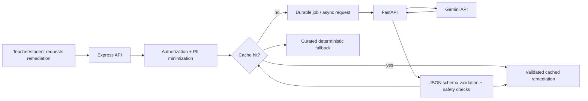

# Page 5 of 6 — AI Enhancement, Privacy, Security, REST API, and WebSockets

## 30. AI/FastAPI architecture

AI is an optional enhancement service. It can create age-appropriate remediation explanations, practice prompts, and teacher-reviewed draft quiz material, but it must never be the authority for scoring, mastery, misconception classification, learning risk, authorization, or quiz completion.

The Express API owns policy, authorization, pseudonymization, caching decisions, and final response validation. FastAPI owns AI-specific request handling, prompt construction, model invocation, output validation, and provider-safe error handling.



### FastAPI service boundary

```text
apps/ai-service/
├── app/              # application startup and dependency wiring
├── routers/          # remediation and quiz-generation endpoints
├── schemas/          # Pydantic request/response schemas
├── services/         # Gemini adapter, prompt, output validation
├── cache/            # cache-key and repository abstraction
├── safety/           # redaction, content guards, policy checks
└── utils/            # observability and correlation helpers
```

The API sends only the necessary educational context: pseudonymous learner token where needed, KC, misconception category, grade/content level, language, approved curriculum context, and explicit output purpose. It does not send names, emails, phone numbers, addresses, raw device IDs, or unnecessary institutional identifiers.

Require structured JSON output. Validate it against a versioned schema before returning anything to the web client. The response must identify itself as AI-assisted where appropriate, include a language, content/prompt version, and a safe fallback status. Provider failures, rate limits, timeouts, malformed output, or safety rejection return a curated remediation activity—not an error that blocks learning.

## 31. AI cache and job design

Cache keys are based on safe, reusable instructional inputs:

```text
contentVersion + KC + misconception + gradeBand + language + outputType + promptVersion
```

Do not key a reusable remediation cache by raw learner identity. Cache entries contain response payload, schema version, provider/model metadata, created/expiry time, content-safety status, and usage count. Enforce TTL, size/entry limits, invalidation after curriculum or prompt changes, and an audit trail of generated content lineage.

Start with a PostgreSQL outbox/job table and a worker interface. This supports retries, idempotency, visibility, and transactional creation without making Redis mandatory. Move the same interface to Redis/BullMQ only after load evidence justifies it. AI requests use timeouts, bounded retry policy, and a circuit breaker to protect normal API capacity.

## 32. Multilingual architecture

User-interface text lives in separate locale bundles: `en`, `hi`, `gu`, `mr`, `ta`, and `te`. Every localized UI string has an English fallback. Date, number, directionality, fonts, and text expansion are tested per locale.

Curriculum content is independently versioned by language; it is not merely a translated UI label. A `QuestionVersion` references one locale and may link to conceptually equivalent locale versions. Quiz delivery selects an approved language package. Deterministic scoring rules and answer alternatives are curated and versioned per language.

AI remediation receives an explicit language parameter, for example:

```json
{
  "knowledgeComponent": "array-indexing",
  "misconception": "prerequisite-gap",
  "language": "gu",
  "contentVersion": "arrays-v3"
}
```

AI output should be reviewed/editorially governed before it becomes reusable instructional content. Voice input and text-to-speech are progressive enhancements using browser APIs when supported; every interaction has a standard keyboard/touch alternative.

## 33. Privacy architecture

Privacy is designed around data minimization, clear purpose, and bounded retention. Separate direct identity data from learning evidence where practical. Use internal IDs and pseudonymous AI tokens. Teacher UI may show authorized learner names, while job logs, AI services, and analytics exports use the minimum identifier required.

| Data category | Purpose | Handling |
|---|---|---|
| Account and classroom identity | Authentication, authorization, roster display | Restrict by tenant/role; encrypt in transit and at rest per provider controls |
| Assessment answers and attempts | Feedback, mastery, intervention evidence | Versioned, scoped to learner/classroom; retention policy required |
| Interaction telemetry | Latency, changes, abandonment, sync reliability | Collect only enumerated educational events; no covert behavioral profiling |
| Device/session identifiers | Kiosk isolation, sync ordering, abuse prevention | Pseudonymous installation/session identifiers; no unnecessary fingerprinting |
| AI requests and cache | Optional instructional remediation | Redact direct PII; log lineage/metadata, not raw private context unless strictly required |

Institutional consent/notice, age/guardian considerations, purpose limitation, retention/deletion processes, access/correction requests, vendor agreements, and incident response need legal and institutional review. These controls are designed with India’s DPDP Act 2023 in mind but do not by themselves establish compliance.

## 34. Security architecture

Security is layered across browser, API, database, deployment, and operations:

- TLS everywhere; HSTS and secure security headers.
- Secure, httpOnly, `SameSite` cookies; short-lived sessions; session revocation; CSRF protection for cookie-authenticated writes.
- Server-side RBAC plus institution/classroom/resource authorization on every request and socket join.
- Zod validation, payload-size limits, content-type controls, output encoding, and parameterized Prisma queries.
- CORS allowlist, rate limits by identity/device/IP as appropriate, abuse monitoring, and login/PIN throttling.
- Secrets in deployment secret managers; never in source, PWA package, client logs, or committed `.env` files.
- Immutable/append-only audit logs for privileged actions, intervention actions, sync anomalies, and authentication/security events.
- Encrypted provider storage/backups, least-privilege DB roles, migration review, dependency scanning, patch process, and tested restores.
- Structured logging with correlation IDs; redact authorization headers, cookies, PINs, access tokens, and direct PII.

Threat-model early: shared-device shoulder surfing and stale screen exposure; account/session theft; cross-tenant IDOR; malicious queued payloads; duplicate/reordered sync; notification disclosure; AI prompt injection/content misuse; dependency compromise; and operational misconfiguration.

## 35. REST API specification

All endpoints use `/api/v1`, JSON request/response bodies, structured errors, pagination where needed, and a correlation/request ID. Mutating endpoints validate an authenticated actor and relevant tenant/resource scope. Responses do not expose fields merely because the requesting role can see a related resource.

```text
Authentication
POST /auth/login
POST /auth/logout
GET  /auth/me

Student
GET  /students/me
GET  /students/me/progress
GET  /students/me/mastery

Classrooms
GET  /classrooms
POST /classrooms
GET  /classrooms/:id
GET  /classrooms/:id/students

Quizzes
POST /quizzes
GET  /quizzes/:id
POST /quizzes/:id/start
POST /quizzes/:id/submit
GET  /quiz-packages/:id                  # authorized versioned offline package

Offline sync
POST /sync/batch

Telemetry and analytics
POST /telemetry
POST /telemetry/batch
GET  /classrooms/:id/analytics
GET  /students/:id/diagnostics
GET  /classrooms/:id/mastery

Interventions
GET  /interventions
GET  /interventions/:id
POST /interventions/:id/acknowledge
POST /interventions/:id/resolve
POST /interventions/:id/snooze
POST /interventions/:id/dismiss

Peer pods and rotations
GET  /peer-pods
POST /peer-pods/generate
GET  /peer-pods/:id
POST /classrooms/:id/rotation-plans
POST /classrooms/:id/start-session

AI
POST /remediation
POST /quiz-generator                         # teacher-reviewed draft only
```

### Sync batch contract

```http
POST /api/v1/sync/batch
Idempotency-Key: 3e7f31f3-0665-46fb-b278-3db9da2a1000
Content-Type: application/json

{
  "deviceId": "device-pseudonymous-id",
  "events": [{
    "eventId": "e25adf1c-8d69-4f5d-98aa-87502d8f0f29",
    "sequence": 42,
    "type": "question.answered",
    "occurredAt": "2026-08-19T10:01:03Z",
    "schemaVersion": 1,
    "payload": { "attemptId": "...", "questionId": "..." }
  }]
}
```

Each response contains item-level `accepted`, `duplicate`, or `rejected` status, a stable receipt ID, and safe machine-readable resolution codes. A duplicate returns the original accepted outcome; it does not create fresh derived analytics or notifications.

## 36. WebSocket event specification

Socket.IO carries event-driven classroom updates, not normal CRUD. The connection authenticates at handshake, revalidates session/room membership as necessary, and joins only explicit authorized rooms such as `institution:{id}:classroom:{id}:teacher`.

| Event | Direction | Purpose |
|---|---|---|
| `student.quiz.submitted` | API → teacher room | Classroom pulse update; minimized summary |
| `student.risk.changed` | API → teacher room | Risk state changed, including explanation reference |
| `intervention.created` | API → teacher room | New deduplicated intervention event |
| `intervention.acknowledged` | API → teacher room | Teacher action/presence update |
| `intervention.resolved` | API → teacher room | Resolution and recheck outcome update |
| `classroom.pulse.updated` | API → teacher room | Aggregate connected/active/pending counts |
| `student.online` / `student.offline` | API → teacher room | Presence signal, not a reliable attendance record |
| `sync.completed` | API → requesting client | Receipt/reconciliation notification |

Every payload includes `eventVersion`, `eventId`, `occurredAt`, and `correlationId`. Validate outgoing and incoming payloads against the same shared Zod contract. Sensitive learner details should be fetched through an authorized REST endpoint when needed, rather than broadcast broadly.

## 37. Page 5 verification gate

Before deployment work begins, test that:

1. Gemini outage, timeout, or malformed output returns a curated fallback and never blocks assessment.
2. PII redaction occurs before an AI request is logged or sent.
3. Cache keys separate language/content/prompt versions and do not use raw student identity.
4. A student cannot access another learner’s diagnostic/intervention data through REST or sockets.
5. Sync and intervention payloads fail schema validation safely.
6. Cookie/CSRF, rate-limit, CORS, secret-scanning, authorization, and audit-log tests pass.

---

**Next:** Page 6 defines testing and performance strategy, deployment, CI/CD, roadmap, risks, architectural trade-offs, and the final MVP recommendation.
