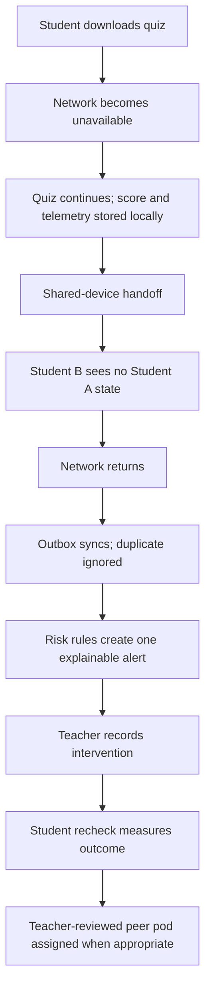
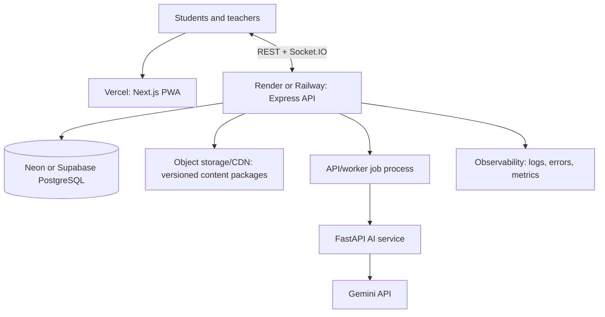
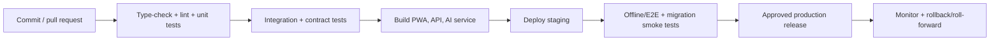

# Page 6 of 6 — Testing, Performance, Deployment, Roadmap, Risks, and Final Recommendation

## 38. Testing strategy

Testing is mandatory because the core product promise—no lost work, no shared-device leakage, and timely explainable intervention—cannot be verified by ordinary UI checks alone.

| Test layer | Scope | Key examples |
|---|---|---|
| Unit | Pure functions and components | Mastery formula, misconception rules, risk thresholds, peer matching, payload schemas |
| Integration | API + PostgreSQL + Prisma + Socket.IO | RBAC, tenancy scope, idempotency receipts, intervention transitions, room authorization |
| Browser/PWA | IndexedDB and service worker behavior | Offline quiz start, answer persistence, queue retry, release/update behavior |
| End-to-end | Real user journeys in Playwright | Shared-device handoff, reconnect, teacher alert, recheck, peer assignment |
| Contract | Cross-service interfaces | Shared Zod DTOs and FastAPI response schemas |
| Accessibility | Automated and manual assistive use | Keyboard quiz flow, screen reader labels, contrast, focus, non-voice fallback |
| Security | Automated plus review | CSRF, IDOR, rate-limit, secret scanning, dependency vulnerabilities, socket-room access |
| Performance/load | Representative devices and classrooms | 40-student sync bursts, Radar latency, package download/cache budgets |

### Required acceptance tests



Use fixture-based learning evidence for deterministic tests. A given fixture must yield the same mastery, misconception, risk, and notification-deduplication result every time. Test clock handling explicitly for cooldowns, latency windows, retries, and rotation timers.

## 39. Performance strategy and measurable budgets

Performance targets are budgets to measure on representative low-end classroom hardware; they are not universal guarantees. Publish actual benchmark results with device, browser, package size, and network conditions.

| Concern | Target | Measurement approach |
|---|---|---|
| Local answer persistence | Under 10ms where realistic | IndexedDB transaction timing on supported low-end devices |
| Deterministic scoring | Under 1ms for a normal attempt excluding I/O | Benchmark pure analytics functions |
| Live teacher update | Typically under 1 second with usable connectivity | Event accepted to authorized Radar render |
| Cached remediation lookup | Single-digit milliseconds in-process | Cache lookup benchmark, excluding network/rendering |
| Initial PWA shell | Prefer under 1MB compressed | Build artifact budget/report |
| Sync reliability | Zero duplicate authoritative side effects | Receipt/idempotency integration and chaos tests |

Optimize in this order: correctness and durable local writes; perceptible responsiveness; package/download size; server/DB indexes and query count; socket fan-out; AI/background queue capacity. Do not omit required accessibility, security, or offline metadata merely to hit a byte target.

## 40. Deployment architecture

Deploy independently deployable runtime boundaries while maintaining one repository and shared contracts.



Before selecting an API host, validate long-lived WebSocket behavior, connection limits, rolling deploy handling, regional placement, health checks, and stable deployment URLs. The PWA can run on Vercel; the socket-capable API needs its own compatible runtime. Store versioned lesson/quiz packages in object storage/CDN rather than database blobs when size or delivery volume warrants it.

Separate development, staging, and production environments with distinct databases, secrets, OAuth/auth configuration, object-store prefixes, telemetry/error destinations, and feature flags. Never test destructive migrations or AI prompts against production learner data.

### Operational controls

- Health/readiness endpoints for API, worker, and AI service.
- Structured logs with correlation IDs and redaction; centralized error tracking.
- Metrics: sync queue backlog, event rejection rate, duplicate rate, socket connection count, Radar alert latency, AI fallback rate, DB connection saturation, and package-download failure rate.
- Encrypted backups, defined retention, restore drills, database migration roll-forward plan, and documented incident response.
- Feature flags for kiosk mode, new scoring/risk rule versions, AI providers, browser notifications, and new locales.

## 41. CI/CD strategy

Every pull request runs formatting, strict TypeScript checks, linting, unit tests, contract tests, Prisma schema/migration validation, API integration tests, and an affected-app build. Nightly or release-candidate pipelines add browser offline/E2E tests, dependency/security scans, and performance smoke benchmarks.



Use expand/contract database migrations: introduce compatible schema first, deploy code that can use both forms, migrate/backfill, then remove obsolete fields in a later release. Do not roll back a destructive migration blindly. Pin dependencies and automate vulnerability updates with review.

## 42. Development roadmap

| Phase | Scope | Exit gate |
|---|---|---|
| 1. Foundation | Monorepo, database, auth, RBAC, shared contracts, seed classroom | Tenant/role authorization and migrations pass |
| 2. Student assessment | Dashboard, KC-mapped micro-quiz, attempts, deterministic score | A complete online 2-minute quiz works |
| 3. Offline and kiosk | PWA, IndexedDB, outbox, idempotent sync, sequential profile isolation | Offline/reconnect/handoff acceptance scenario passes |
| 4. Analytics | Mastery, misconception, risk rules, evidence storage | Deterministic fixture tests and explainability review pass |
| 5. Intervention Radar | Teacher dashboard, sockets, event lifecycle, acknowledgement, recheck | One deduplicated high-risk event reaches authorized teacher |
| 6. Peer learning and rotations | Teacher-reviewed pods, activities, rotation/classroom mode | Capacity/fairness checks and station workflow pass |
| 7. AI and localization | FastAPI, safe cache/fallback, curated locales, accessibility expansion | AI outage and locale/accessibility tests pass |
| 8. Hardening | Observability, load/security testing, documentation, deployment | Production readiness review and restore drill pass |

### Recommended MVP boundary

Include: authentication/RBAC; classrooms and curriculum/KCs; student and teacher dashboards; two-minute downloaded quizzes; IndexedDB/offline outbox; server idempotency; sequential shared-device profiles; deterministic mastery/misconception/risk; in-app/socket Intervention Radar; teacher acknowledgement and recheck; basic teacher-reviewed peer matching; PostgreSQL/Prisma; localization-ready schema; core accessibility and observability.

Defer: simultaneous multi-touch, unreviewed AI quiz generation, mobile/wearable push, rich peer messaging, advanced optimization-based peer matching, universal background sync, broad multilingual assessment content, voice-first flows, and Redis until scale requires it.

## 43. Risks and mitigations

| Risk | Mitigation |
|---|---|
| Network loss or browser crash loses learning | Atomic IndexedDB writes, durable outbox, service-worker shell, recovery tests |
| Shared device exposes prior learner data | Namespace-keyed storage, handoff cache clearing, lock screen, kiosk E2E tests |
| Duplicate/reordered sync corrupts evidence | Globally unique events, server receipts, unique constraints, ordering rules, transactions |
| Teacher alert fatigue | Dedupe keys, aggregation, cooldowns, acknowledgement state, priority policy |
| Risk label harms or stigmatizes learner | Educational-only language, evidence display, teacher override, no emotional/medical inference |
| AI output is wrong or unavailable | Optional path, schema validation, redaction, curated fallback, editorial governance |
| Cross-classroom/tenant data exposure | Resource authorization, scoped repositories, RLS where available, API/socket security tests |
| Premature operational complexity | Modular monolith API, PostgreSQL job outbox, provider interfaces, delay Redis/microservices |
| Local storage capacity exhaustion | Package budgets, download visibility, eviction policy for safe nonessential caches, attention state |
| Privacy/compliance gap | Data inventory, retention schedule, institutional/legal review, vendor governance, access controls |

## 44. Architectural trade-offs and final recommendation

### PostgreSQL over NoSQL

Choose PostgreSQL because the domain is relational and auditable: institution memberships, curriculum/KC maps, assessment versions, learning attempts, device sessions, interventions, peer pods, and audit records all need transactional integrity. Use JSON columns only for bounded, versioned evidence payloads—not as a replacement for core relationships.

### Next.js plus Express

Keep the frontend and API separate. Next.js owns user experience and PWA behavior; Express owns policy, REST, sockets, idempotency, and reliable domain writes. This costs one extra deployment unit but makes real-time and offline logic clearer and safer.

### IndexedDB over localStorage

Use IndexedDB for structured, transactional, larger offline state. `localStorage` is synchronous, limited, and unsuitable for durable quiz/outbox data. Service-worker caches hold immutable assets; IndexedDB holds learner state.

### WebSockets only for live events

Use sockets for teacher Radar/pulse events and state updates. Continue using REST for queryable CRUD and explicit commands. This avoids complex, fragile real-time state synchronization.

### AI stays asynchronous and optional

AI can improve explanations but cannot be allowed to make the learning loop unavailable or unexplainable. Deterministic grading/risk rules remain in the shared analytics engine.

### Redis is not mandatory in the MVP

Begin with PostgreSQL transactions and a durable outbox/cache abstraction. Add Redis/queue infrastructure only when queue throughput, rate-limiting, socket scale, or cache pressure is demonstrated through measurement.

### Wearables and multi-touch are integrations, not foundations

Treat both as optional future adapters. The foundational solution is explicit student/session ownership and a reliable teacher web experience.

## 45. Final recommended architecture

Build a modular monorepo with a local-first Next.js PWA, a policy-enforcing Express API, PostgreSQL/Prisma as the trusted relational record, pure deterministic analytics, Socket.IO for authorized teacher notifications, and an optional FastAPI/Gemini remediation service behind a safe cache and fallback.

Start with the end-to-end classroom loop, not dashboards or AI:

```text
Downloaded 2-minute quiz
  → local answer/telemetry transaction
  → idempotent sync on reconnection
  → authoritative KC mastery and risk calculation
  → one explainable teacher Radar event
  → recorded physical/peer action
  → recheck and measured outcome
```

This architecture directly prioritizes the non-negotiables: no lost progress during temporary outages, no identity mixing on shared devices, no hidden or medicalized learner labels, no notification flood, and no AI dependency for the classroom to function.

---

**Architecture proposal complete.** The next step, when you approve it, is Phase 1 implementation. Before starting implementation, I will list the exact software and accounts you need to install or create.
